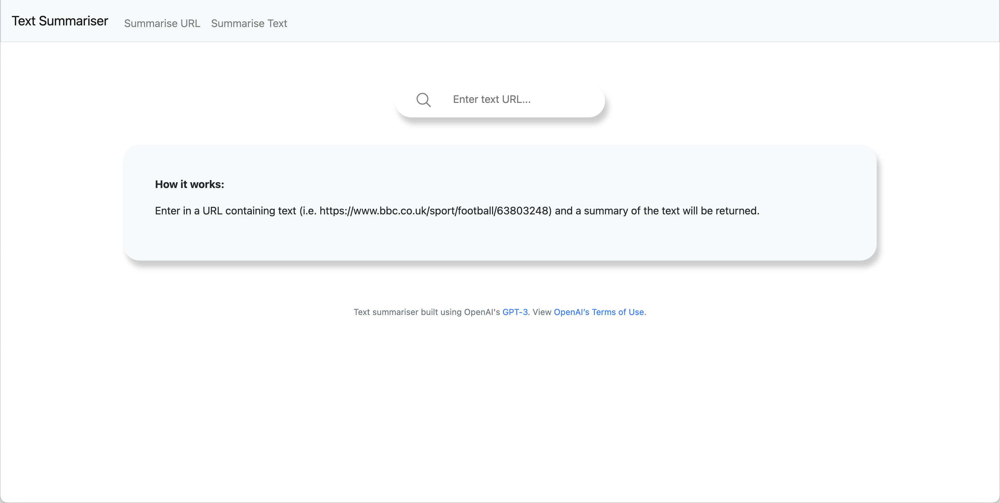

<!-- PROJECT LOGO -->
 

  

  <h3 align="center">Text Summariser</h3>

  

    Text summariser built using OpenAI's Chat-GPT.
  

<!-- ABOUT THE PROJECT -->
## About The Project

 

Using OpenAI's API we have built a web app that is able to summarise a text from a given URL, or summarise a written text.

(<a href="#readme-top">Back to top</a>)

<!-- USAGE -->
## Usage

To get started with this project, pull the image from docker using the following command:

<code> docker pull ejberg/summariser:latest </code>

Once you have downloaded the image, build it with the following command:

<code>docker run --rm -d -p 5000:5000/tcp ejberg/summariser:latest</code>

It should be noted that an API key is required for this program to run.

<!-- CONTACT -->
## Contact

Edwin Jaico-Berg - [@ejaicoberg](https://twitter.com/ejaicoberg) - e.j.berg@outlook.com

Project Link: [https://github.com/EdwinJaico-Berg/stock_predcitor](https://github.com/EdwinJaico-Berg/stock_predictor)

(<a href="#readme-top">Back to top</a>)
